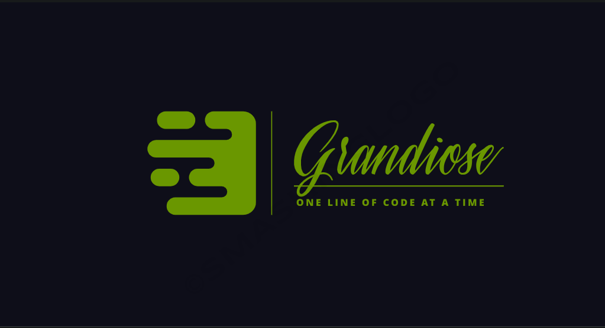

<a name="readme-top"></a>

<div align="center">

  <br/>

  <!-- <h3><b>School Library</b></h3> -->

</div>

# 📗 Table of Contents
- [📗 Table of Contents](#-table-of-contents)
- [📖 Blog App ](#-blog-app-)
  - [🛠 Built With ](#-built-with-)
    - [Tech Stack ](#tech-stack-)
    - [Key Features ](#key-features-)
  - [Getting Started](#getting-started)
    - [Prerequisites](#prerequisites)
    - [Setup](#setup)
    - [Usage](#usage)
    - [Run tests](#run-tests)
    - [Deployment](#deployment)
  - [👥 Authors ](#-authors-)
  - [🔭 Future Features ](#-future-features-)
  - [🤝 Contributing ](#-contributing-)
  - [⭐️ Show your support ](#️-show-your-support-)
  - [🙏 Acknowledgments ](#-acknowledgments-)
  - [📝 License ](#-license-)


# 📖 Blog App <a name="about-project"></a>

**Blog app** is a web application that allows users to create and share their own blogs with the world. Users can sign up for a free account, create a profile with their name, photo, and bio, and start posting their thoughts, opinions, stories, or anything else they want to share. Users can also comment on other users’ posts, like them, and follow their favorite bloggers. Blog app is a platform for expressing yourself, connecting with others, and discovering new perspectives. Blog app is easy to use, secure, and fun. Whether you are a beginner or a seasoned blogger, Blog app is the app for you..

## 🛠 Built With <a name="built-with"></a>

### Tech Stack <a name="tech-stack"></a>
  <details>
    <ul>
      <li><a href="https://www.ruby-lang.org/en/">Ruby</a></li>
      <li><a href="https://rubyonrails.org/">Rails</li>
      <li><a href="https://www.postgresql.org/">Postgresql</li>
    </ul>
  </details>

<p align="right">(<a href="#readme-top">back to top</a>)</p>

### Key Features <a name="key-features"></a>

- **Login**
- **Create a post**
- **Comment to other's users posts**
- **Like other's users posts**

## Getting Started

### Prerequisites
In order to run this project, you must have installed and configured ruby in your local environment:
You we also need to setup Postgres database


### Setup

Clone this repository to your desired folder:

<!--
Example commands:

```sh
  cd my-folder
  git@github.com:MasumaJaffery/Enumerable.git
```
 
--->
Before to run the program, verify that you have Ruby installed on your OS running the following command:
<!--
```sh
   ruby -v
```
--->

### Usage

Run the following command inside the project folder:
1. Open your terminal and navigate to the root directory of your project.
2. run ```$ rails server```
3. open your navigator
4. Go to ```http://localhost:3000/```
5. Enjoy

<p align="right">(<a href="#readme-top">back to top</a>)</p>

### Run tests

You can run this tests

```$
  rubocop
```

```$
    npx stylelint "**/*.{css,scss}"
```

### Deployment

You can deploy this project using: GitHub Pages Netifly or Render 

<p align="right">(<a href="#readme-top">back to top</a>)</p>

## 👥 Authors <a name="authors"></a>

👤 **Joseph L Kausi**

- GitHub: [@Grandi0z](https://github.com/Grandi0z)
- Twitter: [@Joseph_LSK](https://twitter.com/Joseph_LSK)
- LinkedIn: [Joseph L Kausi](https://www.linkedin.com/in/joskal/)


<p align="right">(<a href="#readme-top">back to top</a>)</p>

## 🔭 Future Features <a name="future-features"></a>


- [ ] **Create a user account**
- [ ] **Add a UI**

<!-- CONTRIBUTING -->

## 🤝 Contributing <a name="contributing"></a>

Contributions, issues, and feature requests are welcome!

Feel free to check the [issues page](https://github.com/Grandi0z/blog_app/issues).

<p align="right">(<a href="#readme-top">back to top</a>)</p>

<!-- SUPPORT -->

## ⭐️ Show your support <a name="support"></a>

If you like this project, I would like to Thank You!

<p align="right">(<a href="#readme-top">back to top</a>)</p>

<!-- ACKNOWLEDGEMENTS -->

## 🙏 Acknowledgments <a name="acknowledgements"></a>

Special Thanks to the Microverse and Micronauts.


<p align="right">(<a href="#readme-top">back to top</a>)</p>

<!-- LICENSE -->

## 📝 License <a name="license"></a>

This project is [MIT](https://github.com/Grandi0z/blog_rails/blob/dev/LICENSE) licensed.

<p align="right">(<a href="#readme-top">back to top</a>)</p>
